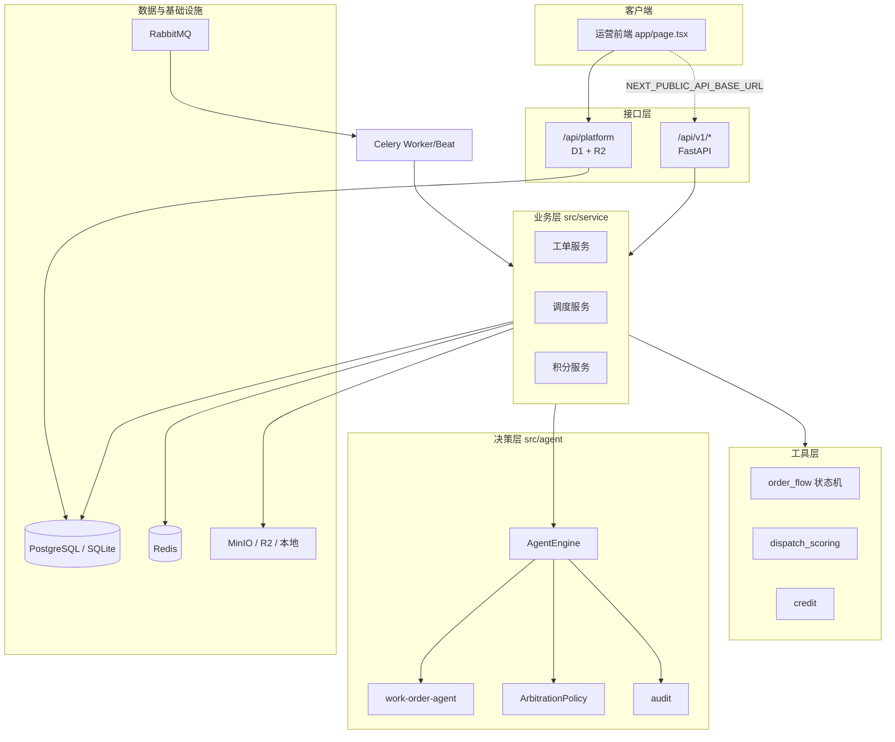

# 灵枢 · 多模态智能工单协同调度平台

灵枢是面向园区物业与设施运维的多模态智能工单系统。居民可通过图片、语音、视频或文字提交报修；系统完成多模态融合、意图识别、置信度评估与智能派单；管理员可在指挥中心查看工单全生命周期、人审队列、人员负载与 Agent 运行状态。

项目包含 **React/Vinext 运营前端**、**Cloudflare Sites 在线接口（D1/R2）** 与 **FastAPI 企业级后端** 两套可独立运行的业务栈，领域规则与 Agent 架构保持一致。

## 核心功能

### 工单与多模态

- 图片、音频、视频上传；格式、大小与归属校验
- 多模态融合产出 `normalized_text` 与 `evidence` 列表
- 工单创建、查询、取消、派单、接单、处理、回访、完成与评价
- 附件存储支持 R2、MinIO、本地目录（`MEDIA_STORAGE_MODE=auto` 自动选择）

### 智能工单决策

- **Work-Order Agent**：按业务 `phase` 完成意图识别（建单/富化）或智能派单（dispatch）；LLM 主路径 + 规则降级
- **仲裁策略**：字段所有权、安全隐患优先、低置信度人审标记
- **审计事件**：`ai_decision`、`ai_conflict`、`ai_dispatch_decision`、`needs_human_review`、`human_review_resolved`

### 运营与管理

- 居民、工作人员、管理员三类角色与权限隔离；管理员可切换视图体验各角色工作台
- 低置信度工单进入 `待人审` 状态，管理端确认后放行派单
- 人员调度看板：技能、区域、负载、评分
- 业务巡检：积压、负载、热点区域告警；Agent Watchdog 健康快照
- 积分绩效、统计概览、督办、限流、链路追踪、结构化日志

## 技术栈

| 层级 | 技术 |
|------|------|
| 前端 | React 19、Vinext、TypeScript、Tailwind CSS |
| 在线接口 | Cloudflare D1（SQLite）、R2、Drizzle ORM |
| 后端 | Python 3.11+、FastAPI、SQLAlchemy 2.0、Pydantic |
| 数据 | SQLite（开发）/ PostgreSQL（生产）、Redis 缓存 |
| 消息与任务 | RabbitMQ、Celery（异步富化、巡检、Watchdog） |
| 对象存储 | MinIO / 本地目录 / R2 |
| AI | OpenAI 兼容 Chat API、Whisper、YOLO（`AI_MODE=local`） |
| 部署 | Docker Compose、Nginx、Locust 压测 |

## 系统架构



**请求路径：** 前端默认调用 `/api/platform`（Sites 本地由 Miniflare 提供 D1/R2）。配置 `NEXT_PUBLIC_API_BASE_URL` 后可对接 FastAPI 后端。两套接口在工单状态、人审闸门、派单规则上保持一致。

## 决策 Agent 模型

| 组件 | 类型 | 职责 |
|------|------|------|
| `work-order-agent` | 决策 Agent | 按 `phase` 完成意图识别（建单/富化）或加权派单 |
| `order_flow` | 确定性工具 | 工单状态机校验与流转 |
| `dispatch_scoring` | 确定性工具 | 加权打分：技能 45% / 负载 25% / 距离 20% / 评分 10% |
| `credit` | 确定性工具 | 评价结算与绩效积分 |
| `ArbitrationPolicy` | 策略层 | 字段冲突仲裁、安全类覆盖、人审标记 |
| `patrol_service` | 运维服务 | 积压、负载、热点巡检 |
| `AgentWatchdog` | 运维服务 | 熔断器与配置探活 |

流水线由 `AGENT_PIPELINE` 配置，默认：

```env
AGENT_PIPELINE=work-order-agent
INTENT_HUMAN_REVIEW_THRESHOLD=0.85
```

## 工单状态

```text
待识别 → 待人审 / 待派单 → 已派单 → 已接单 → 处理中 → 待回访 → 已完成
                ↓
             已取消（多节点可取消）
```

置信度低于 `INTENT_HUMAN_REVIEW_THRESHOLD`（默认 0.85）或仲裁标记冲突时，工单进入 `待人审`。管理端通过人审 API 确认分类与优先级后，状态变为 `待派单`，方可执行智能派单。

## 目录结构

```text
lingshu/
├── main.py                     # FastAPI 入口
├── app/                        # React/Vinext 运营前端
│   ├── page.tsx                # 居民 / 工作人员 / 管理员工作台
│   └── api/platform/route.ts   # Sites 业务 API（D1/R2）
├── db/、drizzle/               # D1 模型与迁移
├── deploy/                     # Docker Compose、Dockerfile、Nginx
├── docs/
│   ├── architecture.md         # 架构详解
│   └── stress_test.md          # 压测说明
├── scripts/                    # 初始化数据、Locust 压测
├── src/
│   ├── api/v1/                 # resident / worker / admin 接口
│   ├── service/                # 工单、调度、积分、巡检服务
│   ├── dao/                    # 数据访问层
│   ├── models/                 # SQLAlchemy ORM
│   ├── schemas/                # Pydantic 模型
│   ├── core/                   # 配置、安全、异常、错误码
│   ├── common/                 # 缓存、熔断、锁、日志、追踪
│   ├── middleware/             # trace、访问日志、限流
│   ├── extensions/             # PostgreSQL、Redis、MinIO 客户端
│   ├── agent/                  # AgentEngine、Hub、决策 Agent、工具、仲裁
│   ├── ai_services/            # 语音、图像、LLM、多模态融合
│   └── tasks/                  # Celery 异步与定时任务
└── tests/                      # API、Service、Agent 测试
```

## 快速开始

### 后端（FastAPI）

```bash
python -m venv .venv
.venv\Scripts\activate          # Windows
pip install -r requirements.txt
copy .env.example .env
python scripts/init_test_data.py
uvicorn main:app --reload
```

API 文档：`http://localhost:8000/docs`

启用本地 Whisper / YOLO：

```bash
pip install -r requirements-ai.txt
```

```env
AI_MODE=local
WHISPER_MODEL=base
YOLO_MODEL=yolov8n.pt
```

默认 `AI_MODE=fallback` 使用规则分析，无需 GPU 即可跑通完整工单链路。

### 前端

```bash
pnpm install
pnpm dev
```

访问 `http://localhost:3000`。前端调用 `/api/platform`；本地开发由 Miniflare 提供 D1/R2 持久化。

### 完整基础设施（Docker）

```bash
copy .env.example .env
docker compose -f deploy/docker-compose.yml up --build
```

包含 API、Celery Worker/Beat、PostgreSQL、Redis、RabbitMQ、MinIO、Nginx。

## 演示账号

| 角色 | 用户名 | 密码 |
|------|--------|------|
| 居民 | resident | resident123 |
| 工作人员 | worker | worker123 |
| 管理员 | admin | admin123 |

## API 概览

### 居民 `/api/v1/resident`

| 路径 | 说明 |
|------|------|
| `POST /auth/login` | 登录 |
| `POST /media` | 上传附件，返回 `object_key` |
| `POST /work-orders` | 创建工单（202，触发 Agent 流水线） |
| `GET /work-orders` | 本人工单列表 |
| `POST /work-orders/{id}/rating` | 评价 |
| `POST /work-orders/{id}/cancel` | 取消 |

### 工作人员 `/api/v1/worker`

| 路径 | 说明 |
|------|------|
| `GET /work-orders` | 已分配任务 |
| `POST /work-orders/{id}/status` | 状态流转 |
| `GET /personal/performance` | 积分与绩效 |

### 管理员 `/api/v1/admin`

| 路径 | 说明 |
|------|------|
| `GET /work-orders` | 全局工单列表 |
| `GET /work-orders/human-review` | 人审队列 |
| `POST /work-orders/{id}/dispatch` | 智能派单 |
| `POST /work-orders/{id}/human-review` | 人工审核确认 |
| `POST /work-orders/{id}/supervise` | 督办 |
| `GET /stats/overview` | 统计概览 |
| `GET /system/agents` | Agent 健康 |
| `GET /system/patrol` | 巡检指标 |

### Sites `/api/platform`

前端工作台统一入口：身份切换、工单 CRUD、派单、人审、附件代理、巡检与 Agent 健康快照。领域规则与 FastAPI 版对齐。

## 相关文档

- [系统架构](docs/architecture.md)
- [压测说明](docs/stress_test.md)
