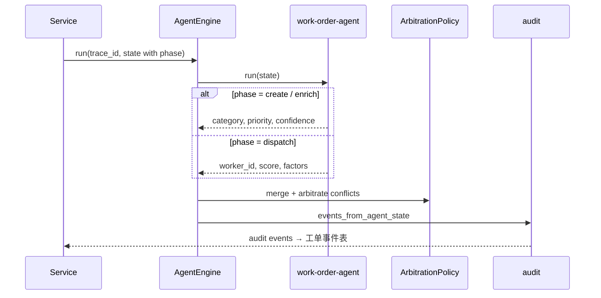

# 系统架构

## 概述

灵枢采用分层架构：接口层负责鉴权与参数校验，Service 层承载业务用例与事务边界，Agent 层通过共享状态黑板（`AgentHub`）执行工单决策，DAO 层隔离数据库访问。决策结果经 `audit` 模块写入工单事件表，形成完整可追溯的处理轨迹。

系统提供两套运行时：

| 运行时 | 入口 | 存储 | 场景 |
|--------|------|------|------|
| FastAPI 后端 | `main.py` → `/api/v1/*` | SQLite / PostgreSQL + Redis + MinIO | 独立部署、企业内网集成 |
| Sites 在线栈 | `app/api/platform/route.ts` | Cloudflare D1 + R2 | 前端工作台、在线演示 |

两套栈在工单状态机、人审闸门、派单拦截、审计事件语义上保持一致。

## 分层架构

```text
┌─────────────────────────────────────────────────────────┐
│  前端 app/page.tsx                                       │
│  居民报修 · 工人任务 · 管理员指挥中心 / 人审 / 调度      │
└──────────────────────────┬──────────────────────────────┘
                           │
         ┌─────────────────┴─────────────────┐
         ▼                                   ▼
┌─────────────────┐               ┌─────────────────────┐
│ /api/platform   │               │ /api/v1/*           │
│ Sites (D1/R2)   │               │ FastAPI             │
└────────┬────────┘               └──────────┬──────────┘
         │                                   │
         └─────────────────┬─────────────────┘
                           ▼
              ┌────────────────────────┐
              │  src/service           │
              │  工单 · 调度 · 积分     │
              │  巡检 · 用户 · 统计     │
              └────────────┬───────────┘
                           │
         ┌─────────────────┼─────────────────┐
         ▼                 ▼                 ▼
┌─────────────┐   ┌──────────────┐   ┌──────────────┐
│ AgentEngine │   │ 确定性工具    │   │ src/dao      │
│ + AgentHub  │   │ order_flow   │   │ → models     │
│ + 仲裁/审计  │   │ scoring/credit│   │ → DB         │
└─────────────┘   └──────────────┘   └──────────────┘
                           │
         ┌─────────────────┼─────────────────┐
         ▼                 ▼                 ▼
   PostgreSQL/SQLite    Redis           MinIO/R2/本地
                           │
                      RabbitMQ
                           │
                    Celery Worker/Beat
```

## 决策流水线

`AgentEngine.shared()` 注册 `work-order-agent`。Service 按业务阶段传入 `phase`，Agent 内部执行对应逻辑：

| phase | 行为 |
|-------|------|
| `create` / `enrich` | LLM + 规则意图识别：分类、优先级、置信度 |
| `dispatch` | 加权打分选人：技能 45% / 负载 25% / 距离 20% / 评分 10% |



实现：`src/agent/work_order_agent.py`

### 意图识别（create / enrich）

输入包含 `normalized_text`、`evidence`（多模态融合产出）、`area` 等。主路径为 OpenAI 兼容 Chat API（`llm_client.classify_intent`），失败时降级到 `intent_rules` 关键词与视觉 evidence 规则。

### 智能派单（dispatch）

调用 `rank_worker_candidates` 工具对候选人加权打分，输出 `worker_id`、`dispatch_score`、`decision_factors`。满载工人自动跳过。

## 确定性工具层

以下模块以纯函数或 Service 直调方式运行，不经过 Agent 黑板：

| 模块 | 路径 | 职责 |
|------|------|------|
| `order_flow` | `src/agent/tools/order_flow.py` | 工单状态机：`TRANSITIONS` 表校验合法流转 |
| `dispatch_scoring` | `src/agent/tools/dispatch_scoring.py` | 候选人打分与 Top-K 排序 |
| `credit` | `src/agent/tools/credit.py` | 评价后积分结算 |

流转推进（接单、处理、回访、完成）与积分结算由 Service 直接调用工具，保证状态不变量由代码强制执行。

## 仲裁策略

`ArbitrationPolicy`（`src/agent/policies/arbitration.py`）在 `AgentHub._merge` 阶段介入，处理多 Agent 写入同一字段时的冲突：

- **字段所有权**：`category`、`priority`、`tags`、`confidence` 归意图阶段；`worker_id`、`dispatch_score` 等归派单阶段
- **安全覆盖**：`安全隐患` 类别优先于其他分类
- **置信度比较**：同类冲突时保留高置信度写入方
- **人审标记**：无法自动裁决时写入 `_human_review`，触发 `needs_human_review` 审计事件

## 审计与人审

### 审计事件

`src/agent/audit.py` 将 Agent 决策转化为工单事件：

| action | 触发条件 |
|--------|----------|
| `ai_decision` | 意图识别产出有效决策 |
| `ai_conflict` | 仲裁策略解决字段冲突 |
| `ai_dispatch_decision` | 派单完成，含打分因子 |
| `needs_human_review` | 置信度低于阈值或仲裁标记人审 |
| `human_review_resolved` | 管理员确认分类与优先级 |

事件 detail 以 JSON 存储决策上下文，供前端处理轨迹展示。

### 人审流程

```text
建单 → Intent 产出 confidence
         │
         ├─ confidence ≥ 0.85 → 状态「待派单」
         │
         └─ confidence < 0.85 → 状态「待人审」
                                    │
                            管理员人审 API 确认
                                    │
                              状态「待派单」
                                    │
                              智能派单 →「已派单」
```

`待人审` 状态下调用派单接口返回 HTTP 412（`HUMAN_REVIEW_REQUIRED`）。管理端接口：

- FastAPI：`GET /api/v1/admin/work-orders/human-review`、`POST /api/v1/admin/work-orders/{id}/human-review`
- Sites：`POST /api/platform` with `action: "human_review"`

前端管理端提供「人审队列」页面与工单详情内的人工审核表单。

## 多模态 AI 服务

`src/ai_services/` 提供融合与模型适配：

| 模块 | 职责 |
|------|------|
| `multimodal_fusion` | 汇总附件分析结果，产出 `normalized_text` 与 `evidence` |
| `speech_service` | 语音转写（Whisper，`AI_MODE=local`） |
| `vision_service` | 图像/视频目标检测（YOLO） |
| `llm_client` | OpenAI 兼容 Chat API：意图分类 |

`AI_MODE=fallback` 时使用规则拼接摘要与关键词分类；`AI_MODE=local` 或 `production` 时启用真实模型，配合熔断器（`src/common/circuit_breaker.py`）与备用模型路由。

## 巡检与 Watchdog

### patrol_service

定时扫描业务指标（`src/service/patrol_service.py`）：

- 积压工单数（`PATROL_BACKLOG_THRESHOLD`，默认 20）
- 工人利用率（`PATROL_UTILIZATION_THRESHOLD`，默认 0.85）
- 热点区域（`PATROL_HOTSPOT_THRESHOLD`，默认 10）

结果持久化到 `system_configs`，通过 `GET /api/v1/admin/system/patrol` 与前端 `opsHealth` 展示。

### AgentWatchdog

`src/agent/watchdog.py` 检查熔断器状态与 Agent 配置，定时任务写入健康快照。管理端 `GET /api/v1/admin/system/agents` 返回各 Agent 运行状态。

## 缓存与降级

| 组件 | 策略 |
|------|------|
| 统计概览 / 绩效 | L1 进程内存 + L2 Redis，TTL 可配置 |
| Redis 不可用 | 退化为单实例内存锁与 L1 缓存 |
| LLM 不可用 | 意图走规则；派单仍走确定性打分 |
| RabbitMQ 不可用 | 同步 API 正常，Celery 任务暂停 |
| MinIO 不可用 | `MEDIA_STORAGE_MODE=auto` 退化为 `LOCAL_MEDIA_DIR` |

## 部署拓扑

Docker Compose（`deploy/docker-compose.yml`）包含：

```text
nginx → api (FastAPI)
          ├── postgres
          ├── redis
          ├── rabbitmq
          ├── minio
          ├── celery-worker
          └── celery-beat
```

Celery Beat 调度：异步多模态富化、巡检落库、Watchdog 健康快照。

开发环境仅需 Python venv + SQLite，无需启动中间件即可跑通工单全链路。

## 角色权限

| 角色 | 能力 |
|------|------|
| resident（居民） | 报修上传、查看本人工单、评价、取消 |
| worker（工作人员） | 查看已分配任务、状态流转、查看绩效 |
| admin（管理员） | 全局工单、人审队列、智能派单、督办、人员调度、Agent 健康、巡检、统计、系统配置 |

认证基于 JWT（`ACCESS_TOKEN_EXPIRE_MINUTES`），接口域按 `/resident`、`/worker`、`/admin` 前缀隔离。前端通过 `x-workorder-role` 头切换管理员演示视图。
